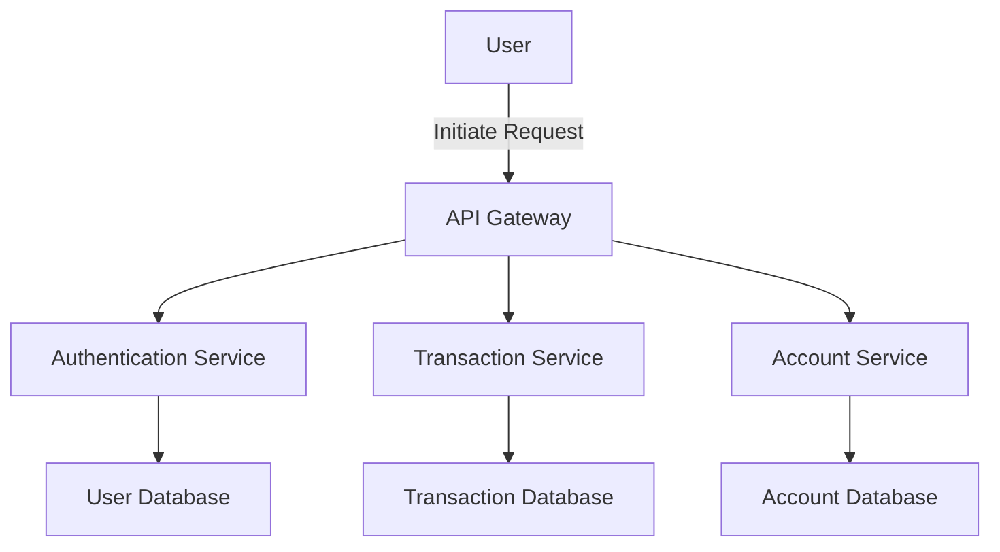
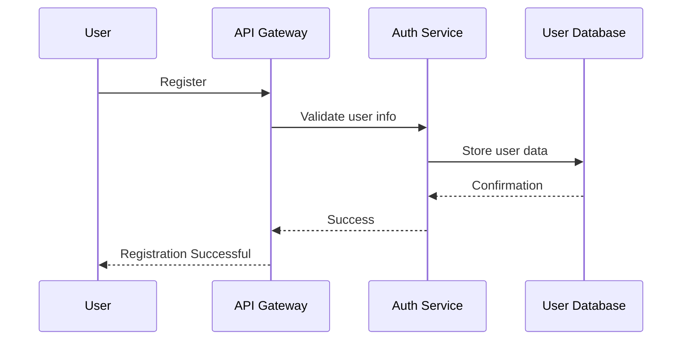
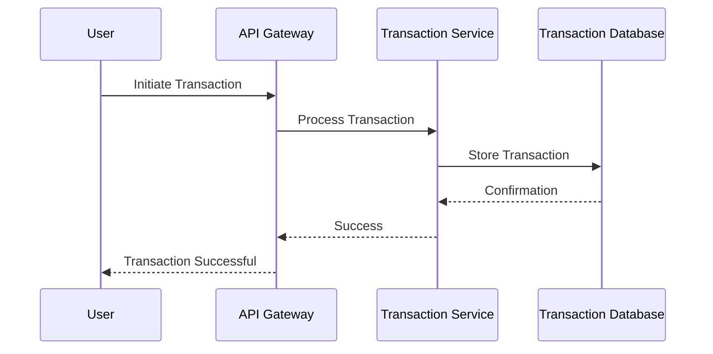

# SYSTEM DESIGN

## Introduction
This document provides comprehensive architecture documentation for a Bank & Credit Card Platform. It includes details on architecture, request flows, and implementation specifics.

## Architecture Overview

- **User**: The end-user interacting with the platform.  
- **API Gateway**: Entry point for all client requests.  
- **Authentication Service**: Manages user authentication and authorization.  
- **Transaction Service**: Handles all transaction-related operations.  
- **Account Service**: Manages user accounts and profiles.  
- **Databases**: Store user and transaction data.

## Request Flows
### User Registration Flow

### Transaction Processing Flow

## Implementation Details
- **Technologies Used**:  
  - Backend: Node.js, Express  
  - Database: MongoDB  
  - Frontend: React  

- **Key Classes and Methods**:  
  - `UserController`: Handles user registration and authentication.  
  - `TransactionController`: Manages transaction processing.  
  
- **Database Schema Overview**:  
  - User Collection: { userId, username, passwordHash, email }  
  - Transaction Collection: { transactionId, userId, amount, status }  

## Conclusion
This document outlines the architecture of the Bank & Credit Card Platform, detailing the implementation and request flows necessary for understanding the system's functioning.